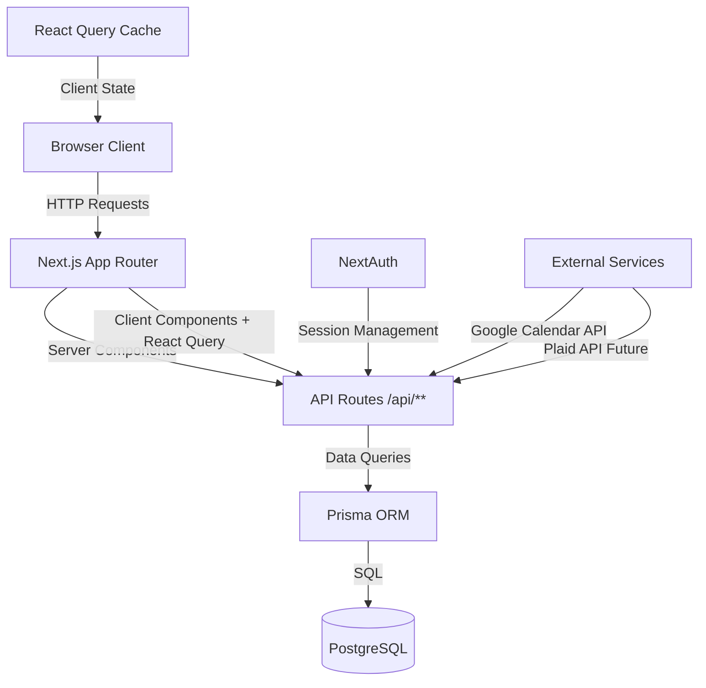
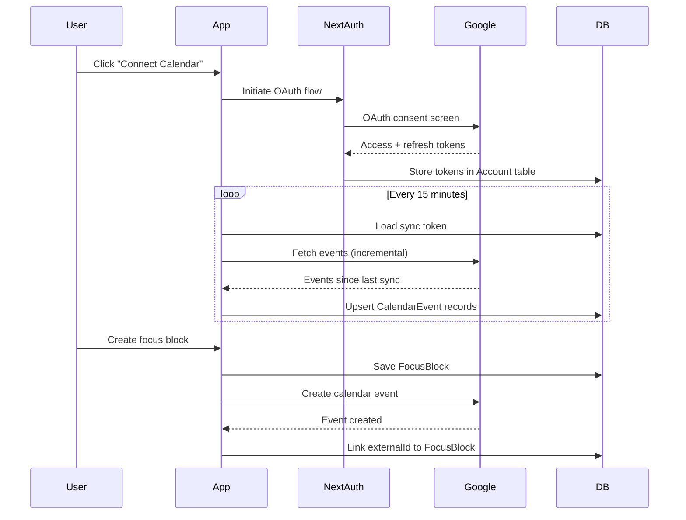
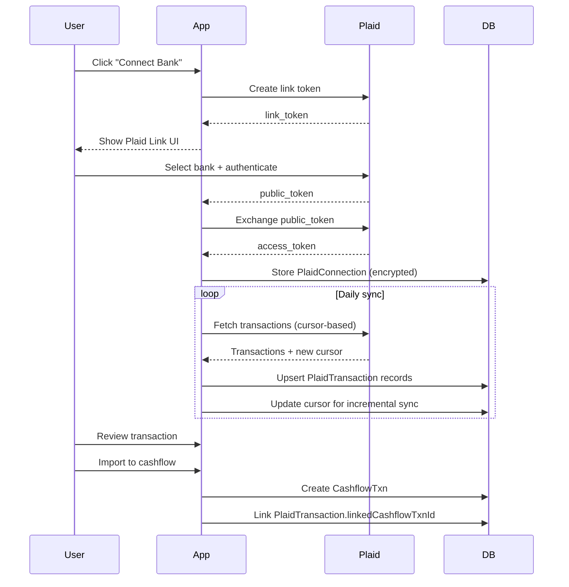
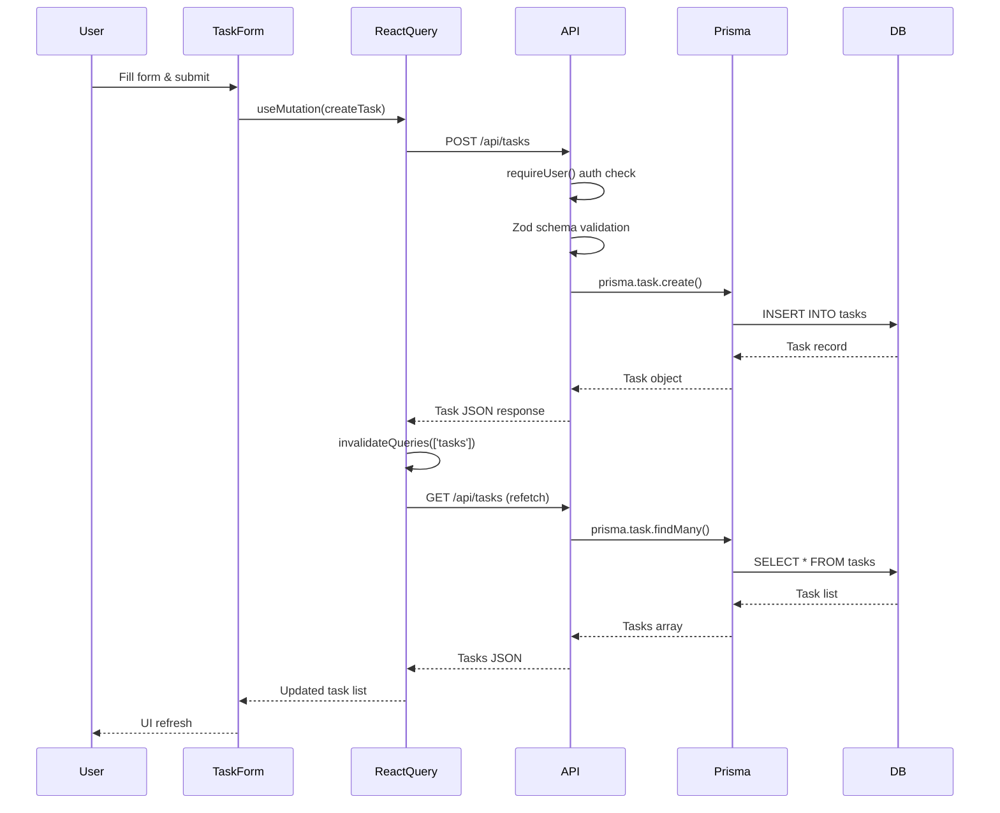
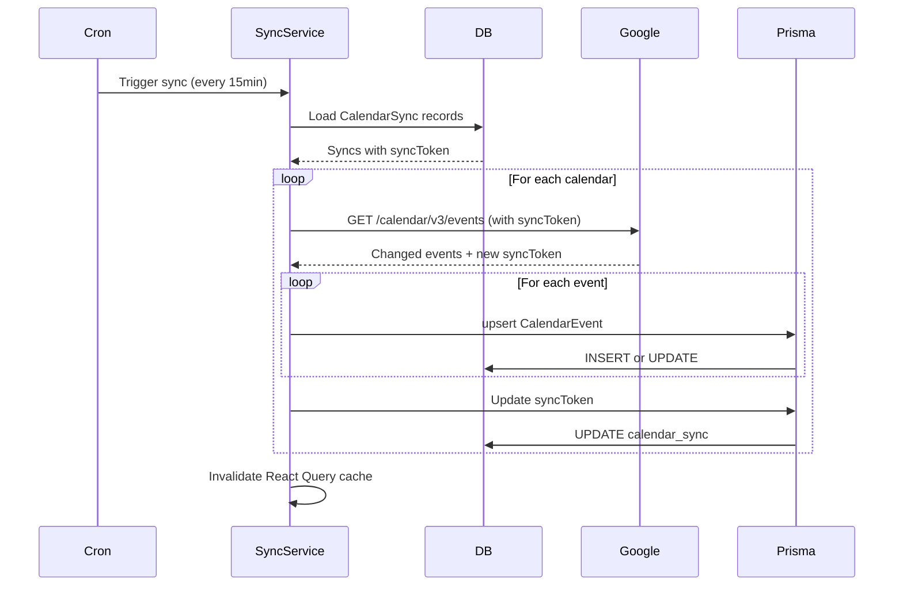
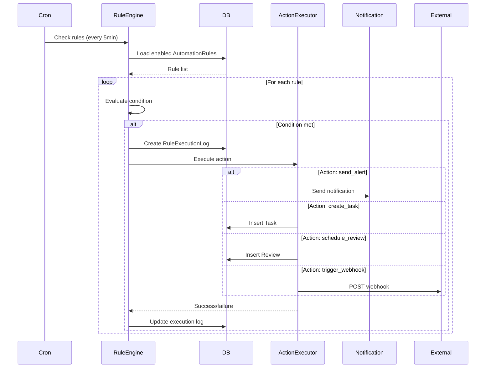
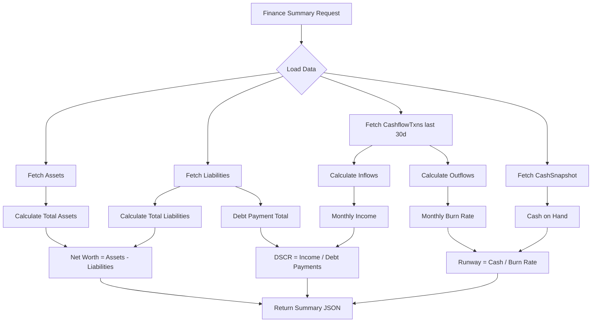
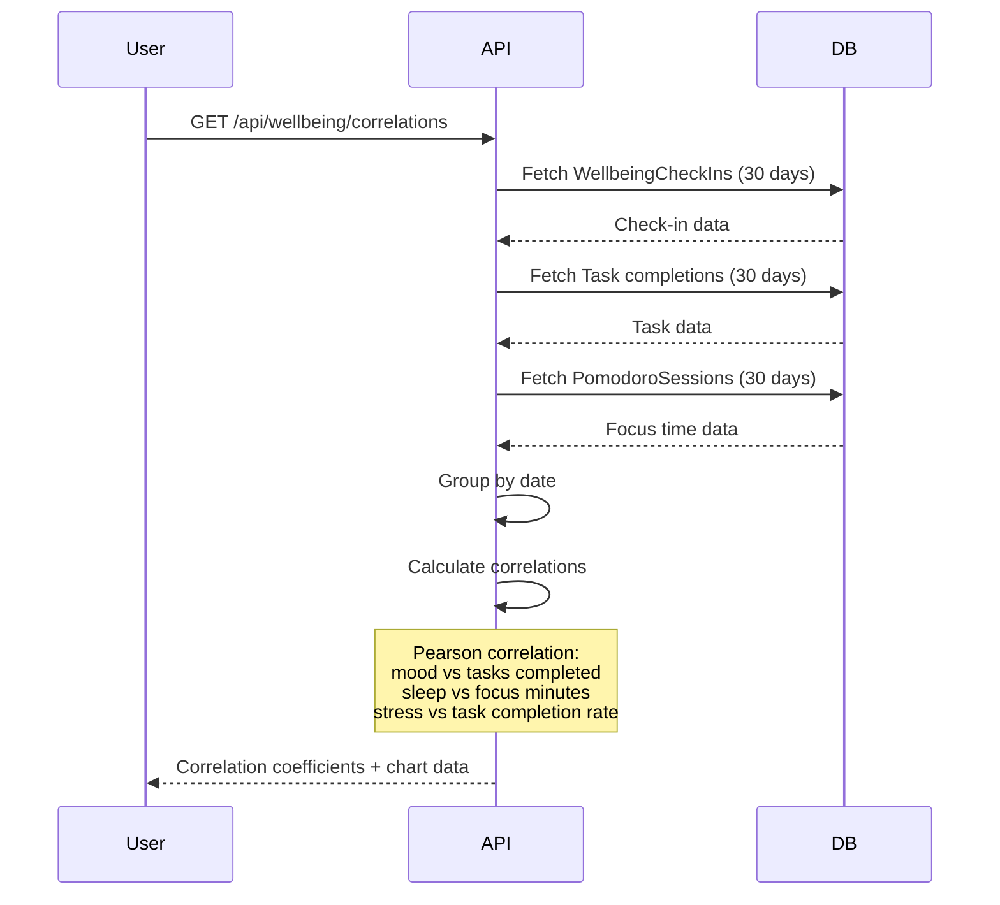

# Structure Is Grace – Architecture & Interconnections

_Last updated: 2025-12-04_

This document explains how the application is wired today, how data flows end-to-end, and where to look if something breaks. It pairs with `docs/roadmap.md` to show both current state and planned evolution.

---

## Table of Contents

1. [Runtime Topology](#1-runtime-topology)
2. [Shared Infrastructure](#2-shared-infrastructure)
3. [Feature Modules](#3-feature-modules)
4. [API Contract Overview](#4-api-contract-overview)
5. [React Query Patterns](#5-react-query-patterns)
6. [Data Flow Architecture](#6-data-flow-architecture)
7. [Failure Domains & Debugging](#7-failure-domains--debugging)
8. [Integration Status](#8-integration-status)
9. [Testing & Quality Hooks](#9-testing--quality-hooks)
10. [Filemap Cheat-Sheet](#10-filemap-cheat-sheet)
11. [Maintenance Checklist](#11-maintenance-checklist)

---

## 1. Runtime Topology

### 1.1 Tech stack
- **Web**: Next.js App Router (v15) with React Server Components. TypeScript throughout.
- **State/query**: React Query for client-side caching/mutations (`<Providers>` sets a `QueryClient`).
- **Styles**: Tailwind CSS, global tokens in `src/app/globals.css`.
- **APIs**: Next.js route handlers under `src/app/api/**` (77 route files).
- **Data**: PostgreSQL via Prisma Client.
- **Auth**: NextAuth (email magic link + Google OAuth). Session context exposed through `SessionProvider` and `requireUser()` helper.

### 1.2 Request lifecycle
1. **Browser → Next.js Route** – App Router loads layout wrappers and server components.
2. **Server data fetch** – Server components call libraries in `src/lib/**` (e.g., `getFinanceInitialData`) which in turn query Prisma.
3. **Client hydration** – Client components (e.g., `FinanceDashboard`) get initial data via props, then React Query revalidates through `/api/**` endpoints.
4. **Mutations** – Client fire-and-forget using `postJson/patchJson/deleteRequest`. On success we invalidate relevant query keys so caches refresh.

### 1.3 System Architecture Overview



---

## 2. Shared Infrastructure

### 2.1 Providers
`src/components/providers.tsx` wraps the app with:
- `SessionProvider` from NextAuth – surfaces `useSession` and guards server calls.
- `QueryClientProvider` – React Query client created per session; responsible for caching, dedupe, refetch intervals.

### 2.2 Auth utilities
- `src/lib/server-session.ts` – `requireUser`, `getUser`, `getServerSession`. Used inside server components/API handlers to enforce auth.
- `src/lib/auth.ts` – NextAuth configuration (email provider + Google OAuth, callbacks, token refresh).

### 2.3 Database access
- `src/lib/prisma.ts` – reuses Prisma client across hot reloads.
- **Prisma schema** (`prisma/schema.prisma`) – 40+ models covering:
  - **Core**: User, Account, Session, VerificationToken
  - **Finance**: Asset, Liability, CashflowTxn, CashSnapshot, BudgetEnvelope, CashflowTemplate, PlaidConnection, PlaidAccount, PlaidTransaction
  - **Goals & Projects**: MacroGoal, Project, Task, Objective, KeyResult
  - **Habits & Wellbeing**: Habit, HabitCompletion, WellbeingCheckIn, WearableSync, WearableMetric, MicroBreak
  - **Time Management**: FocusBlock, PomodoroSession, CalendarSync, CalendarEvent
  - **Knowledge**: Resource, ReadingSession, FlashCard
  - **Social**: AccountabilityPartner, CoWorkingSession, WeeklyRecap
  - **Automation**: AutomationRule, RuleExecutionLog, AICopilotConversation, NLCapture
  - **Journal & Reviews**: JournalEntry, Review
  - **Legacy**: StartEvent, StudySession, Idea, Action, RoutineExperiment, Reminder
- Cascading deletes maintain referential integrity.

### 2.4 Utility libraries
- `src/lib/date.ts` – date formatting helpers.
- `src/lib/finance.ts` – central place for finance queries, serialization, KPI math.
- `src/lib/api-handler.ts` – unified error handling wrapper for API routes.
- `src/lib/logger.ts` – structured logging.
- `src/lib/analytics.ts` – event tracking.
- `src/lib/calendar/google-sync.ts` – Google Calendar sync service.

---

## 3. Feature Modules

### 3.1 Finance Module

**Entry point**: `src/app/(dashboard)/finance/page.tsx`
- Guards with `requireUser()` → fetches initial data via `getFinanceInitialData(user.id)`.
- Renders `<FinanceDashboard>` with hydrated assets, liabilities, cashflow, summary totals.

**Client component**: `src/components/finance/finance-dashboard.tsx`
- Maintains form state for assets, liabilities, cashflow.
- React Query query keys: `['finance','assets']`, `['finance','liabilities']`, `['finance','cashflow']`, `['finance','summary']`.
- Mutations invalidate relevant keys ensuring KPIs stay accurate.
- UI surfaces: KPIs, tables, modal dialogs.

**API routes**:
- `src/app/api/finance/assets/route.ts` (GET list, POST create)
- `src/app/api/finance/assets/[id]/route.ts` (PATCH, DELETE)
- Equivalent structure for `liabilities` and `cashflow`
- All routes: call `requireUser`, validate payload with Zod, use Prisma for CRUD, return serialized records

**Server lib**: `src/lib/finance.ts`
- `getAssets`, `getLiabilities`, `getCashflow` (ordered queries)
- `computeFinanceSummary` calculates net worth, runway, DSCR, debt utilization by combining assets, liabilities, and recent cashflow (30-day window)
- `getFinanceInitialData` orchestrates parallel fetch + serialization for server component hydration

**Data relationships**:
```
User ──< Asset
     └─< Liability
     └─< CashflowTxn
     └─< CashSnapshot (for cash-on-hand)
     └─< BudgetEnvelope
     └─< CashflowTemplate
```

**Key features**:
- Net worth tracking (assets - liabilities)
- Runway calculation (cash / monthly burn rate)
- DSCR (Debt Service Coverage Ratio)
- Budget envelopes with period tracking (monthly/quarterly/yearly)
- Recurring transaction templates
- CSV export of cashflow

---

### 3.2 Tasks & Project Management Module

**Entry point**: `src/app/(dashboard)/tasks/page.tsx`, `src/app/(dashboard)/projects/page.tsx`
- Three-level hierarchy: `MacroGoal → Project → Task`
- Task priority scoring: impact × effort matrix (Eisenhower)
- Views: Kanban (by status), List (checkbox), Priority Matrix (2×2 quadrants)
- Quick capture modal for rapid task entry

**API routes**:
- `src/app/api/tasks/route.ts` (GET list with filters, POST create)
  - Filters: status, priority, projectId, tag
  - Auto-calculates priorityScore (impact × effort)
- `src/app/api/tasks/[id]/route.ts` (GET, PATCH, DELETE)
- `src/app/api/tasks/priorities/route.ts` (GET priority matrix analysis)
- `src/app/api/projects/route.ts` (GET with stats, POST)
- `src/app/api/projects/[id]/route.ts` (GET, PATCH, DELETE)
- `src/app/api/projects/[id]/progress/route.ts` (GET velocity & completion forecasts)

**Data models**:
```prisma
Task {
  status: TaskStatus (todo, in_progress, blocked, completed, cancelled)
  priority: TaskPriority (low, medium, high, urgent)
  effort: Int (1-5 scale)
  impact: Int (1-5 scale)
  dueDate, completedAt
  projectId, tags[]
}

Project {
  status: ProjectStatus (planning, active, paused, completed, cancelled)
  macroGoalId
  targetDate
  tasks[]
}
```

**Key features**:
- Filtering: status, priority, project, tags
- Progress tracking: completion %, velocity (tasks/day)
- Deadline prediction based on historical velocity
- Automatic timestamp tracking (completedAt on status change)

**React Query keys**:
- `['tasks']` – all tasks with filters
- `['tasks', taskId]` – single task detail
- `['tasks', 'priorities']` – priority matrix data
- `['projects']` – project list
- `['projects', projectId]` – single project with tasks
- `['projects', projectId, 'progress']` – velocity analytics

---

### 3.3 Habits Tracking Module

**Entry point**: `src/app/(dashboard)/habits/page.tsx`
- Daily/weekly/monthly cadence support
- Streak calculation (current & longest)
- GitHub-style heatmap visualization (12 weeks)
- Completion rate analytics

**API routes**:
- `src/app/api/habits/route.ts` (GET, POST)
- `src/app/api/habits/[id]/route.ts` (GET, PATCH, DELETE)
- `src/app/api/habits/[id]/completions/route.ts` (POST toggle on/off, GET history)
- `src/app/api/habits/[id]/streak/route.ts` (GET current & longest streaks)

**Data models**:
```prisma
Habit {
  cadence: HabitCadence (daily, weekly, monthly)
  targetCount: Int (per cadence period)
  color, icon
  isActive
}

HabitCompletion {
  habitId
  date
  note
  @@unique([habitId, date])
}
```

**Components**:
- `HabitTracker`: Main dashboard with quick "Log Today" buttons
- `HabitHeatmap`: 12-week visualization with hover tooltips
- `StreakDisplay`: Fire emoji for current, star for best
- `HabitForm`: Icon picker, color picker, cadence selector

**Streak logic**:
- Daily: consecutive days with completions
- Weekly: consecutive weeks with ≥1 completion
- Monthly: consecutive months with ≥1 completion

**React Query keys**:
- `['habits']` – all habits
- `['habits', habitId]` – single habit
- `['habits', habitId, 'completions']` – completion history
- `['habits', habitId, 'streak']` – streak analytics

---

### 3.4 Focus Blocks & Time Management Module

**Entry point**: `src/app/(dashboard)/focus-blocks/page.tsx`
- Time-boxing interface for planned work sessions
- Integration with tasks and calendar
- Actual vs. planned time tracking

**API routes**:
- `src/app/api/focus-blocks/route.ts` (GET with date/task filters, POST create)
- `src/app/api/focus-blocks/[id]/route.ts` (GET, PATCH, DELETE)
- `src/app/api/focus-blocks/[id]/start/route.ts` (POST start session)
- `src/app/api/focus-blocks/[id]/complete/route.ts` (POST complete session)

**Data model**:
```prisma
FocusBlock {
  taskId?
  title, description
  startTime, endTime (planned)
  actualStartTime, actualEndTime
  completed
  calendarEventId
  pomodoroSessions[]
}
```

**Key features**:
- Calendar integration (auto-creates Google Calendar events)
- Task linkage (focus blocks tied to tasks)
- Actual time tracking (start/complete actions)
- Pomodoro session nesting

**React Query keys**:
- `['focus-blocks']` – all focus blocks with filters
- `['focus-blocks', blockId]` – single block detail
- `['focus-blocks', 'today']` – today's schedule

---

### 3.5 Pomodoro Timer Module

**Entry point**: `src/app/(dashboard)/pomodoro/page.tsx`
- Classic Pomodoro Technique: 25min work, 5min break, 15min long break
- Real-time timer with notifications
- Session history tracking

**API routes**:
- `src/app/api/pomodoro/route.ts` (GET history, POST start session)
- `src/app/api/pomodoro/[id]/route.ts` (GET, PATCH)
- `src/app/api/pomodoro/[id]/complete/route.ts` (POST complete)
- `src/app/api/pomodoro/[id]/interrupt/route.ts` (POST interrupt)

**Data model**:
```prisma
PomodoroSession {
  type: PomodoroType (work, short_break, long_break)
  durationMinutes (default 25)
  startTime, endTime
  completed, interrupted
  taskId, focusBlockId
}
```

**Key features**:
- Configurable work/break durations
- Interrupt tracking (for analytics)
- Task and focus block linkage
- Session statistics (completion rate, total minutes)

**React Query keys**:
- `['pomodoro', 'active']` – current running session
- `['pomodoro', 'history']` – past sessions
- `['pomodoro', 'stats']` – analytics

---

### 3.6 Journal & Reflection Module

**Entry point**: `src/app/(dashboard)/journal/page.tsx`
- Daily reflection prompts (AM/PM/custom)
- Sentiment analysis (keyword-based)
- Tag-based organization
- Calendar view of entries

**API routes**:
- `src/app/api/journal/route.ts` (GET with filters, POST create)
  - Filters: type, period (week/month), startDate/endDate
  - Auto-calculates sentiment score and label
- `src/app/api/journal/[id]/route.ts` (GET, PATCH, DELETE)
- `src/app/api/journal/sentiment-trends/route.ts` (GET analytics)

**Data model**:
```prisma
JournalEntry {
  type: JournalType (reflection, am, pm, custom)
  date, content
  promptQuestion
  sentimentScore (Float -1.0 to 1.0)
  sentimentLabel (negative, neutral, positive)
  tags[]
}
```

**Sentiment analysis**:
- Keyword-based analysis with positive/negative word lists
- Score calculation: (positive - negative) / total
- Label thresholds: >0.2 positive, <-0.2 negative, else neutral

**Key features**:
- Prompted journaling (AM: intentions, PM: reflections)
- Sentiment tracking over time
- Tag-based organization
- Search and filtering

**React Query keys**:
- `['journal', 'entries']` – entry list with filters
- `['journal', entryId]` – single entry
- `['journal', 'sentiment-trends']` – sentiment analytics

---

### 3.7 OKRs (Objectives & Key Results) Module

**Entry point**: `src/app/(dashboard)/okrs/page.tsx`
- Quarterly goal-setting framework
- Objective → Key Results hierarchy
- Confidence rating tracking (0-100%)
- Progress visualization

**API routes**:
- `src/app/api/okrs/objectives/route.ts` (GET with filters, POST)
  - Filters: quarter, status, projectId
  - Includes key results in response
- `src/app/api/okrs/objectives/[id]/route.ts` (GET, PATCH, DELETE)
- `src/app/api/okrs/key-results/route.ts` (GET, POST)
- `src/app/api/okrs/key-results/[id]/route.ts` (GET, PATCH, DELETE)

**Data models**:
```prisma
Objective {
  quarter (e.g., "Q1 2025")
  status: ObjectiveStatus (active, completed, cancelled)
  confidenceRating (0-100%)
  startDate, endDate
  projectId, macroGoalId
  keyResults[]
}

KeyResult {
  targetValue, currentValue
  unit (e.g., "dollars", "tasks")
  isCompleted
  confidenceRating (0-100%)
}
```

**Key features**:
- Quarterly OKR cycles
- Progress tracking (currentValue / targetValue)
- Confidence self-assessment
- Project and macro goal linkage
- Completion percentage visualization

**React Query keys**:
- `['okrs', 'objectives']` – all objectives with filters
- `['okrs', 'objectives', objectiveId]` – single objective with KRs
- `['okrs', 'key-results', krId]` – single key result

---

### 3.8 Reviews & Retrospectives Module

**Entry point**: `src/app/(dashboard)/reviews/page.tsx`
- Automated weekly/monthly/quarterly/yearly reviews
- Aggregates data from all modules
- Email delivery support
- Review history archive

**API routes**:
- `src/app/api/reviews/route.ts` (GET history, POST generate)
- `src/app/api/reviews/[id]/route.ts` (GET, PATCH, DELETE)
- `src/app/api/reviews/generate/route.ts` (POST trigger generation)
- `src/app/api/reviews/[id]/send-email/route.ts` (POST email delivery)

**Data model**:
```prisma
Review {
  type: ReviewType (weekly, monthly, quarterly, yearly)
  period (e.g., "Week 48 2025")
  startDate, endDate
  financeSummary (JSON)
  taskSummary (JSON)
  habitSummary (JSON)
  journalSummary (JSON)
  pomodoroSummary (JSON)
  highlights[], lowlights[], actionItems[]
  emailSentAt
}
```

**Summary data structure**:
```typescript
financeSummary: {
  income, expenses, runway, budgetVariance
}
taskSummary: {
  completed, total, completionRate
}
habitSummary: {
  completionRate, topHabits, streaks
}
journalSummary: {
  entryCount, avgSentiment, sentimentTrend
}
pomodoroSummary: {
  sessionsCompleted, totalMinutes
}
```

**Key features**:
- Automated data aggregation from all modules
- Customizable highlights/lowlights
- Action item tracking
- Email delivery to user or accountability partners
- Historical review archive

**React Query keys**:
- `['reviews']` – review history
- `['reviews', reviewId]` – single review detail
- `['reviews', 'latest']` – most recent review by type

---

### 3.9 Knowledge & Learning Module

**Entry point**: `src/app/(dashboard)/knowledge/page.tsx`
- Resource library (articles, videos, books, podcasts, courses)
- Reading session tracking
- Spaced repetition flashcards
- Progress tracking

**API routes**:
- `src/app/api/knowledge/resources/route.ts` (GET with filters, POST)
  - Filters: type, category, macroGoalId, projectId, isFavorite
  - Includes readingSessions and flashCards
- `src/app/api/knowledge/resources/[id]/route.ts` (GET, PATCH, DELETE)
- `src/app/api/knowledge/reading-sessions/route.ts` (GET, POST)
- `src/app/api/knowledge/reading-sessions/[id]/route.ts` (PATCH)
- `src/app/api/knowledge/flashcards/route.ts` (GET due cards, POST)
- `src/app/api/knowledge/flashcards/[id]/route.ts` (GET, PATCH, DELETE)
- `src/app/api/knowledge/flashcards/[id]/review/route.ts` (POST review with grade)

**Data models**:
```prisma
Resource {
  type: ResourceType (article, video, book, podcast, course, other)
  url, title, description
  category, tags[]
  macroGoalId, projectId
  isFavorite
  readingSessions[]
  flashCards[]
}

ReadingSession {
  startTime, endTime, minutes
  progress (0-100%)
  notes
}

FlashCard {
  front, back
  status: FlashCardStatus (new, learning, review, mastered)
  easeFactor, interval, repetitions
  lastReviewedAt, nextReviewAt
  tags[]
}
```

**Flashcard algorithm** (Spaced Repetition - SM2):
- Grades: 0 (again), 1 (hard), 2 (good), 3 (easy)
- Ease factor adjustment based on grade
- Interval doubling for successful reviews
- Reset to learning status for failed reviews

**Key features**:
- Resource library with tagging and favorites
- Reading time tracking
- Progress percentage per resource
- Spaced repetition flashcard system
- Due card queue
- Statistics: total study time, cards mastered, streak

**React Query keys**:
- `['knowledge', 'resources']` – resource list with filters
- `['knowledge', 'resources', resourceId]` – single resource with sessions
- `['knowledge', 'reading-sessions']` – reading history
- `['knowledge', 'flashcards', 'due']` – cards due for review
- `['knowledge', 'flashcards', cardId]` – single flashcard

---

### 3.10 Wellbeing & Health Module

**Entry point**: `src/app/(dashboard)/wellbeing/page.tsx`
- Daily check-ins (sleep, mood, energy, stress, physical health)
- Wearable integration (Apple Health, Google Fit, Fitbit, Garmin)
- Micro-break scheduler
- Correlation analytics (wellbeing vs. productivity)

**API routes**:
- `src/app/api/wellbeing/check-ins/route.ts` (GET with date range, POST upsert)
  - Returns check-ins + averages
- `src/app/api/wellbeing/check-ins/[id]/route.ts` (GET, PATCH, DELETE)
- `src/app/api/wellbeing/wearables/route.ts` (GET connections, POST connect)
- `src/app/api/wellbeing/wearables/[id]/sync/route.ts` (POST trigger sync)
- `src/app/api/wellbeing/micro-breaks/route.ts` (GET scheduled, POST schedule)
- `src/app/api/wellbeing/micro-breaks/[id]/complete/route.ts` (POST complete)
- `src/app/api/wellbeing/correlations/route.ts` (GET analytics)

**Data models**:
```prisma
WellbeingCheckIn {
  date
  sleepHours, sleepQuality (1-10)
  mood: MoodLevel (very_low, low, neutral, good, excellent)
  energy: EnergyLevel (exhausted, low, moderate, high, energized)
  stressLevel (1-10), physicalHealth (1-10)
  notes
  @@unique([userId, date])
}

WearableSync {
  provider: WearableProvider
  isEnabled
  lastSyncAt, syncToken
  encryptedAuth
  metrics[]
}

WearableMetric {
  date
  steps, activeMinutes, caloriesBurned
  heartRateAvg/Max/Min
  distance, workoutMinutes
  rawData (JSON)
}

MicroBreak {
  scheduledAt, completedAt
  type (mindful, stretch, walk, etc.)
  duration (minutes)
}
```

**Key features**:
- Daily wellbeing tracking with 1-click input
- Wearable data sync (OAuth + encrypted credentials)
- Micro-break reminders (integrates with calendar)
- Correlation analytics: mood vs. task completion, sleep vs. focus time
- Trend visualization (7/30/90 day charts)

**React Query keys**:
- `['wellbeing', 'check-ins']` – check-in history with averages
- `['wellbeing', 'check-ins', date]` – specific day
- `['wellbeing', 'wearables']` – connected wearables
- `['wellbeing', 'metrics']` – wearable data
- `['wellbeing', 'micro-breaks']` – scheduled breaks
- `['wellbeing', 'correlations']` – analytics

---

### 3.11 Social & Accountability Module

**Entry point**: `src/app/(dashboard)/social/page.tsx`
- Accountability partner invitations
- Shared dashboard views (permission-based)
- Co-working sessions
- Weekly recap email generation

**API routes**:
- `src/app/api/social/partners/route.ts` (GET partners, POST invite)
- `src/app/api/social/partners/[id]/route.ts` (GET, PATCH, DELETE)
- `src/app/api/social/partners/[id]/accept/route.ts` (POST accept invitation)
- `src/app/api/social/co-working/route.ts` (GET sessions, POST create)
- `src/app/api/social/co-working/[id]/route.ts` (GET, PATCH, DELETE)
- `src/app/api/social/co-working/[id]/join/route.ts` (POST join session)
- `src/app/api/social/recaps/route.ts` (GET history, POST generate)
- `src/app/api/social/recaps/[id]/share/route.ts` (POST share with partners)

**Data models**:
```prisma
AccountabilityPartner {
  partnerEmail, partnerUserId
  status: PartnershipStatus (pending, active, paused, ended)
  permissions: SharePermission[] (dashboard_view, finance_summary, goals_view, etc.)
  invitedAt, acceptedAt, lastContactAt
  notes
}

CoWorkingSession {
  title, description
  scheduledStart, scheduledEnd
  actualStartTime, actualEndTime
  calendarEventId, inviteLink
  participants[]
}

WeeklyRecap {
  weekStart, weekEnd
  generatedAt, emailSentAt
  content (JSON - full recap data)
  sharedWithIds[]
  viewCount
}
```

**Key features**:
- Invite partners via email (with or without account)
- Granular permission sharing
- Co-working session scheduling (integrates with calendar)
- Session participant tracking (join/leave times, focus minutes)
- Automated weekly recap generation
- Share recap with accountability partners

**React Query keys**:
- `['social', 'partners']` – accountability partners
- `['social', 'co-working']` – co-working sessions
- `['social', 'co-working', sessionId]` – session detail with participants
- `['social', 'recaps']` – weekly recap history
- `['social', 'shared-dashboard', partnerId]` – partner's shared view

---

### 3.12 Automation & Rules Engine Module

**Entry point**: `src/app/(dashboard)/automation/page.tsx`
- Rule-based automation ("if-then" logic)
- Condition monitoring (runway low, habit streak broken, budget exceeded, etc.)
- Action execution (create task, send alert, schedule review, trigger webhook)
- Execution history and debugging

**API routes**:
- `src/app/api/automation/rules/route.ts` (GET rules, POST create)
  - Includes recent execution logs (last 5)
- `src/app/api/automation/rules/[id]/route.ts` (GET, PATCH, DELETE)
- `src/app/api/automation/rules/[id]/toggle/route.ts` (POST enable/disable)
- `src/app/api/automation/rules/[id]/test/route.ts` (POST test execution)
- `src/app/api/automation/execution-logs/route.ts` (GET log history)

**Data models**:
```prisma
AutomationRule {
  name, description
  conditionType: RuleConditionType
    (runway_low, habit_streak_broken, budget_exceeded,
     task_overdue, goal_progress_stalled, wellbeing_declining, custom)
  conditionConfig (JSON)
  actionType: RuleActionType
    (send_alert, create_task, schedule_review, send_email,
     trigger_webhook, custom)
  actionConfig (JSON)
  isEnabled
  lastTriggeredAt, triggerCount
  executionLogs[]
}

RuleExecutionLog {
  triggeredAt
  success
  result (JSON)
  error
}
```

**Example rules**:
```javascript
// Runway low alert
{
  conditionType: 'runway_low',
  conditionConfig: { threshold: 3, unit: 'months' },
  actionType: 'send_alert',
  actionConfig: { channel: 'email', priority: 'high' }
}

// Habit streak broken → create review task
{
  conditionType: 'habit_streak_broken',
  conditionConfig: { habitId: 'xyz', streakThreshold: 7 },
  actionType: 'create_task',
  actionConfig: {
    title: 'Review meditation habit',
    priority: 'high',
    dueInDays: 1
  }
}

// Budget exceeded → schedule review
{
  conditionType: 'budget_exceeded',
  conditionConfig: { envelopeId: 'abc', exceedancePercent: 10 },
  actionType: 'schedule_review',
  actionConfig: { reviewType: 'financial', dueInDays: 3 }
}
```

**Key features**:
- Visual rule builder (future: drag-and-drop)
- Condition monitoring (runs via cron or event triggers)
- Action execution with rollback support
- Execution history with success/failure tracking
- Test mode for rule validation
- Webhook integration for external systems

**React Query keys**:
- `['automation', 'rules']` – all rules
- `['automation', 'rules', ruleId]` – single rule with logs
- `['automation', 'logs']` – execution history

---

### 3.13 AI Copilot Module

**Entry point**: `src/app/(dashboard)/ai/page.tsx`
- Conversational AI for queries and insights
- Natural language capture ("Log $45 groceries yesterday")
- Weekly summary generation
- Priority suggestions
- Financial anomaly detection

**API routes**:
- `src/app/api/ai/conversations/route.ts` (GET history, POST create)
- `src/app/api/ai/conversations/[id]/route.ts` (GET, DELETE)
- `src/app/api/ai/conversations/[id]/messages/route.ts` (POST send message)
- `src/app/api/ai/nl-capture/route.ts` (POST parse natural language input)
- `src/app/api/ai/insights/route.ts` (GET generated insights)
- `src/app/api/ai/summarize/route.ts` (POST generate summary)

**Data models**:
```prisma
AICopilotConversation {
  title
  messages (JSON array)
    // [{role: 'user'|'assistant', content: string, timestamp: ISO}]
  context (JSON - relevant data passed to AI)
}

NLCapture {
  rawInput (user's natural language text)
  parsedData (JSON - extracted entities)
  entityType (cashflow, task, habit, etc.)
  entityId (ID of created entity)
  confidence (0-1 score from NLP)
  isProcessed
  error
}
```

**Natural language parsing examples**:
```
Input: "Log $45 groceries yesterday"
Output: {
  entityType: 'cashflow',
  amountCents: 4500,
  category: 'groceries',
  date: '2025-12-03',
  direction: 'outflow'
}

Input: "Create task: review Q1 budget, high priority, due friday"
Output: {
  entityType: 'task',
  title: 'review Q1 budget',
  priority: 'high',
  dueDate: '2025-12-08'
}

Input: "Log meditation habit for today"
Output: {
  entityType: 'habit_completion',
  habitName: 'meditation',
  date: '2025-12-04'
}
```

**Key features**:
- Chat interface with conversation history
- Context-aware responses (pulls in user's finance/task/habit data)
- Natural language parsing for quick capture
- Insight generation (weekly summaries, anomaly detection)
- Priority suggestions based on task matrix and deadlines
- Export conversation as markdown

**React Query keys**:
- `['ai', 'conversations']` – conversation list
- `['ai', 'conversations', conversationId]` – single conversation with messages
- `['ai', 'insights']` – generated insights
- `['ai', 'nl-captures']` – recent captures

---

### 3.14 Google Calendar Integration

**Entry point**: `src/app/(dashboard)/calendar/page.tsx`
- OAuth 2.0 flow with Google Calendar API
- Automatic token refresh via NextAuth callbacks
- Two-way sync: pull Google events, push focus blocks/habits/reminders
- Smart scheduling: suggest available time slots based on calendar

**Auth configuration** (`src/lib/auth.ts`):
- Google OAuth provider with calendar scopes
- Refresh token rotation in JWT callback
- Access token stored in database Account table
- Session includes access token for API calls

**Sync service** (`src/lib/calendar/google-sync.ts`):
- `GoogleCalendarSync` class handles all Google Calendar operations
- Incremental sync using sync tokens (reduces API calls)
- Event upsert pattern (idempotent sync)
- Available slot detection for smart scheduling
- Support for multiple calendars per user

**API routes**:
- `src/app/api/calendar/sync/route.ts` (POST trigger sync, GET sync status)
- `src/app/api/calendar/events/route.ts` (GET filtered events, POST create)
- `src/app/api/calendar/available-slots/route.ts` (GET free time slots)

**Data models**:
```prisma
CalendarSync {
  provider (default "google")
  calendarId
  syncEnabled
  lastSyncAt, nextSyncAt
  syncToken (for incremental sync)
  events[]
}

CalendarEvent {
  externalId (Google event ID)
  title, description
  startTime, endTime, isAllDay
  linkedTaskId, linkedHabitId, linkedProjectId
  linkedFocusBlockId, linkedPomodoroId
  linkedFinanceIds[] (for bill reminders)
  enrichedData (JSON)
}
```

**Data flow**:


**Key features**:
- Automatic token refresh (no user re-auth required)
- Incremental sync (only fetch changed events)
- Two-way sync (read Google events, write focus blocks/habits)
- Event linking (tasks, habits, finance reminders)
- Smart scheduling (find available time slots)
- Multi-calendar support

**React Query keys**:
- `['calendar', 'syncs']` – calendar sync configurations
- `['calendar', 'events']` – calendar events with filters
- `['calendar', 'available-slots']` – free time slots

---

### 3.15 Plaid Financial Integration (In Progress)

**Entry point**: `src/app/(dashboard)/plaid/page.tsx`
- Bank account connection via Plaid Link
- Automated transaction sync
- Account balance tracking
- Transaction categorization and mapping

**API routes**:
- `src/app/api/plaid/link-token/route.ts` (POST create link token) - **STUB**
- `src/app/api/plaid/exchange-token/route.ts` (POST exchange public token)
- `src/app/api/plaid/connections/route.ts` (GET connections, POST revoke)
- `src/app/api/plaid/accounts/route.ts` (GET accounts with balances)
- `src/app/api/plaid/transactions/route.ts` (GET transactions, POST sync)
- `src/app/api/plaid/transactions/[id]/import/route.ts` (POST import to CashflowTxn)

**Data models**:
```prisma
PlaidConnection {
  plaidItemId, plaidAccessToken (encrypted)
  institutionId, institutionName
  isEnabled
  syncStatus: PlaidSyncStatus (healthy, requires_update, error)
  lastSyncAt, cursor (for incremental sync)
  consentGivenAt, consentRevokedAt
  accounts[], syncLogs[]
}

PlaidAccount {
  plaidAccountId, name, officialName
  type: PlaidAccountType (checking, savings, credit_card, investment, loan)
  mask (last 4 digits)
  currentBalanceCents, availableBalanceCents, creditLimitCents
  lastBalanceUpdate
  transactions[]
}

PlaidTransaction {
  plaidTransactionId, date, authorizedDate
  name, merchantName
  amountCents
  category[] (Plaid's hierarchy)
  pending
  linkedCashflowTxnId (if imported)
  isHidden
}
```

**Sync flow**:


**Key features** (planned):
- OAuth-style bank connection
- Encrypted credential storage
- Incremental transaction sync (cursor-based)
- Account balance updates
- Transaction categorization (Plaid categories → app categories)
- Import to cashflow with mapping
- Duplicate detection (don't import same transaction twice)
- Consent management (revoke access)

**Security considerations**:
- Access tokens encrypted at rest
- Credentials never stored in plain text
- User consent required and tracked
- Ability to revoke access immediately
- Sync logs for audit trail

**React Query keys**:
- `['plaid', 'connections']` – connected institutions
- `['plaid', 'accounts']` – bank accounts
- `['plaid', 'transactions']` – transaction list with filters
- `['plaid', 'sync-status']` – sync health

---

### 3.16 Metrics Dashboard

**Page**: `src/app/(dashboard)/dashboard/metrics/page.tsx`
- Server loads initial Today metrics (starts, study minutes, cash) and Macro goals.
- Client component `MetricsDashboard` (in `src/components/metrics-dashboard.tsx`) handles charts via Recharts.
- `TodayMetrics` uses React Query to poll `/api/metrics/today` with `refetchInterval` 60s.
- Macro goals saved through `/api/macro-goal/[id]` PATCH (mutation invalidates `['metrics','trends']`).

**Relevant data**:
- `StartEvent`, `StudySession`, `CashSnapshot`, `MacroGoal` models.
- Charts rely on API aggregator `src/app/api/metrics/trends/route.ts` (provides consolidated JSON).

---

### 3.17 Auth Hardening & Session Management

**Refresh token rotation** (`src/lib/auth.ts`):
- JWT callback intercepts token expiration
- Automatic refresh using Google's token endpoint
- Database update with new tokens (security best practice)
- Error state flagged in session on refresh failure

**Session management** (`src/components/settings/session-management.tsx`):
- List all active sessions per user
- Individual session termination
- "Sign out all other devices" bulk action
- Session expiry display

**API routes**:
- `src/app/api/auth/sessions/route.ts` (GET list, DELETE single or all)
- `src/app/api/user/profile/route.ts` (GET, PATCH user settings)

**Profile settings** (`src/app/(dashboard)/settings/page.tsx`):
- Timezone selection (affects date display)
- Currency preference (affects financial formatting)
- Default start duration (minutes)
- Account info display (ID, member since)

**Notification center** (`src/components/notifications/notification-center.tsx`):
- Task reminders (due dates)
- Finance alerts (budget overages)
- Habit milestones (streak achievements)
- System notifications
- Unread count badge
- Filter: all/unread
- Mark as read/mark all as read

---

### 3.18 Experiments / Journal (Legacy)

- Routes exist under `src/app/(dashboard)/(experiments|reminders)`.
- Data models defined (e.g., `RoutineExperiment`, `Reminder`, `Idea`, `Action`).
- Partially implemented, may be superseded by newer modules.

---

## 4. API Contract Overview

**Complete API Surface** (77 route files across 29 modules):

| Route | Method | Purpose | Auth |
| --- | --- | --- | --- |
| **Finance** ||||
| `/api/finance/assets` | GET/POST | manage assets | Required |
| `/api/finance/assets/[id]` | PATCH/DELETE | mutate asset | Required |
| `/api/finance/liabilities` | GET/POST | manage liabilities | Required |
| `/api/finance/liabilities/[id]` | PATCH/DELETE | mutate liability | Required |
| `/api/finance/cashflow` | GET/POST | manage cashflow | Required |
| `/api/finance/cashflow/[id]` | PATCH/DELETE | mutate cashflow | Required |
| `/api/finance/summary` | GET | recompute KPIs | Required |
| `/api/finance/templates` | GET/POST | cashflow templates | Required |
| `/api/finance/budgets` | GET/POST | budget envelopes | Required |
| **Tasks & Projects** ||||
| `/api/tasks` | GET/POST | list/create tasks | Required |
| `/api/tasks/[id]` | GET/PATCH/DELETE | task CRUD | Required |
| `/api/tasks/priorities` | GET | priority matrix analysis | Required |
| `/api/projects` | GET/POST | list/create projects | Required |
| `/api/projects/[id]` | GET/PATCH/DELETE | project CRUD | Required |
| `/api/projects/[id]/progress` | GET | velocity & forecasts | Required |
| **Habits** ||||
| `/api/habits` | GET/POST | list/create habits | Required |
| `/api/habits/[id]` | GET/PATCH/DELETE | habit CRUD | Required |
| `/api/habits/[id]/completions` | POST/GET | toggle/list completions | Required |
| `/api/habits/[id]/streak` | GET | streak analytics | Required |
| **Focus Blocks** ||||
| `/api/focus-blocks` | GET/POST | list/create blocks | Required |
| `/api/focus-blocks/[id]` | GET/PATCH/DELETE | block CRUD | Required |
| `/api/focus-blocks/[id]/start` | POST | start block | Required |
| `/api/focus-blocks/[id]/complete` | POST | complete block | Required |
| **Pomodoro** ||||
| `/api/pomodoro` | GET/POST | history/start session | Required |
| `/api/pomodoro/[id]` | GET/PATCH | session CRUD | Required |
| `/api/pomodoro/[id]/complete` | POST | complete session | Required |
| `/api/pomodoro/[id]/interrupt` | POST | interrupt session | Required |
| **Journal** ||||
| `/api/journal` | GET/POST | list/create entries | Required |
| `/api/journal/[id]` | GET/PATCH/DELETE | entry CRUD | Required |
| `/api/journal/sentiment-trends` | GET | sentiment analytics | Required |
| **OKRs** ||||
| `/api/okrs/objectives` | GET/POST | list/create objectives | Required |
| `/api/okrs/objectives/[id]` | GET/PATCH/DELETE | objective CRUD | Required |
| `/api/okrs/key-results` | GET/POST | list/create KRs | Required |
| `/api/okrs/key-results/[id]` | GET/PATCH/DELETE | KR CRUD | Required |
| **Reviews** ||||
| `/api/reviews` | GET/POST | history/generate review | Required |
| `/api/reviews/[id]` | GET/PATCH/DELETE | review CRUD | Required |
| `/api/reviews/generate` | POST | trigger generation | Required |
| `/api/reviews/[id]/send-email` | POST | email delivery | Required |
| **Knowledge** ||||
| `/api/knowledge/resources` | GET/POST | resource library | Required |
| `/api/knowledge/resources/[id]` | GET/PATCH/DELETE | resource CRUD | Required |
| `/api/knowledge/reading-sessions` | GET/POST | session tracking | Required |
| `/api/knowledge/flashcards` | GET/POST | flashcard queue | Required |
| `/api/knowledge/flashcards/[id]/review` | POST | review with grade | Required |
| **Wellbeing** ||||
| `/api/wellbeing/check-ins` | GET/POST | daily check-ins | Required |
| `/api/wellbeing/wearables` | GET/POST | wearable connections | Required |
| `/api/wellbeing/wearables/[id]/sync` | POST | trigger sync | Required |
| `/api/wellbeing/micro-breaks` | GET/POST | break scheduling | Required |
| `/api/wellbeing/correlations` | GET | analytics | Required |
| **Social** ||||
| `/api/social/partners` | GET/POST | partner management | Required |
| `/api/social/partners/[id]/accept` | POST | accept invitation | Required |
| `/api/social/co-working` | GET/POST | session management | Required |
| `/api/social/co-working/[id]/join` | POST | join session | Required |
| `/api/social/recaps` | GET/POST | weekly recap | Required |
| **Automation** ||||
| `/api/automation/rules` | GET/POST | rule management | Required |
| `/api/automation/rules/[id]` | GET/PATCH/DELETE | rule CRUD | Required |
| `/api/automation/rules/[id]/toggle` | POST | enable/disable | Required |
| `/api/automation/rules/[id]/test` | POST | test execution | Required |
| `/api/automation/execution-logs` | GET | log history | Required |
| **AI Copilot** ||||
| `/api/ai/conversations` | GET/POST | chat management | Required |
| `/api/ai/conversations/[id]/messages` | POST | send message | Required |
| `/api/ai/nl-capture` | POST | parse NL input | Required |
| `/api/ai/insights` | GET | generated insights | Required |
| `/api/ai/summarize` | POST | generate summary | Required |
| **Calendar** ||||
| `/api/calendar/sync` | POST/GET | trigger/status sync | Required |
| `/api/calendar/events` | GET/POST | list/create events | Required |
| `/api/calendar/available-slots` | GET | smart scheduling | Required |
| **Plaid** ||||
| `/api/plaid/link-token` | POST | create link token | Required |
| `/api/plaid/exchange-token` | POST | exchange public token | Required |
| `/api/plaid/connections` | GET/POST | connection management | Required |
| `/api/plaid/accounts` | GET | account list | Required |
| `/api/plaid/transactions` | GET/POST | transaction sync | Required |
| **Auth & Settings** ||||
| `/api/auth/sessions` | GET/DELETE | session management | Required |
| `/api/user/profile` | GET/PATCH | user settings | Required |
| **Metrics** ||||
| `/api/metrics/today` | GET | dashboard summary | Required |
| `/api/metrics/trends` | GET | charts & macro goals | Required |
| `/api/macro-goal/[id]` | PATCH | update macro goal | Required |
| **Auth routes** | (NextAuth) | login/logout (Google OAuth + Email) | Public entry |

**Common patterns**:
- All endpoints rely on `requireUser()` or `getServerSession()` for auth
- Zod schema validation on POST/PATCH requests
- Prisma `where: { userId: user.id }` ensures data tenancy
- JSON responses with appropriate HTTP status codes
- Error handling via `apiHandler` wrapper (some routes)

---

## 5. React Query Patterns

### 5.1 Key naming conventions
- **Namespace by domain**: `['finance', 'assets']`, `['tasks']`, `['habits']`
- **Include ID for detail views**: `['tasks', taskId]`, `['projects', projectId]`
- **Suffix for analytics**: `['habits', habitId, 'streak']`, `['projects', projectId, 'progress']`

### 5.2 Invalidation strategies

**Finance module** (`src/components/finance/finance-dashboard.tsx`):
```typescript
// After asset mutation
queryClient.invalidateQueries({ queryKey: ['finance', 'assets'] });
queryClient.invalidateQueries({ queryKey: ['finance', 'summary'] });

// After cashflow mutation
queryClient.invalidateQueries({ queryKey: ['finance', 'cashflow'] });
queryClient.invalidateQueries({ queryKey: ['finance', 'summary'] });
```

**Tasks module** (`src/lib/api/tasks.ts`):
```typescript
// After task mutation
queryClient.invalidateQueries({ queryKey: ['tasks'] });
queryClient.invalidateQueries({ queryKey: ['projects', task.projectId] });
queryClient.invalidateQueries({ queryKey: ['tasks', 'priorities'] });
```

**Habits module** (`src/lib/api/habits.ts`):
```typescript
// After habit completion
queryClient.invalidateQueries({ queryKey: ['habits', habitId] });
queryClient.invalidateQueries({ queryKey: ['habits', habitId, 'completions'] });
queryClient.invalidateQueries({ queryKey: ['habits', habitId, 'streak'] });
```

**Cross-module invalidation**:
```typescript
// Focus block completion affects multiple modules
queryClient.invalidateQueries({ queryKey: ['focus-blocks'] });
queryClient.invalidateQueries({ queryKey: ['tasks', taskId] });
queryClient.invalidateQueries({ queryKey: ['calendar', 'events'] });
queryClient.invalidateQueries({ queryKey: ['metrics', 'today'] });
```

### 5.3 Hydration pattern

**Server component** (`src/app/(dashboard)/tasks/page.tsx`):
```typescript
export default async function TasksPage() {
  const user = await requireUser();
  const initialTasks = await prisma.task.findMany({
    where: { userId: user.id },
    include: { project: true },
  });

  return <TaskList initialData={initialTasks} />;
}
```

**Client component** (`src/components/tasks/task-list.tsx`):
```typescript
export function TaskList({ initialData }: { initialData: Task[] }) {
  const { data: tasks } = useQuery({
    queryKey: ['tasks'],
    queryFn: fetchTasks,
    initialData, // Prevents flash of loading state
  });

  return <div>{/* render tasks */}</div>;
}
```

### 5.4 Polling for live updates

**Today metrics** (`src/components/today-metrics.tsx`):
```typescript
const { data } = useQuery({
  queryKey: ['metrics', 'today'],
  queryFn: fetchTodayMetrics,
  refetchInterval: 60000, // Poll every 60 seconds
  staleTime: 30000, // Consider fresh for 30 seconds
});
```

### 5.5 Optimistic updates

**Habit completion** (`src/lib/api/habits.ts`):
```typescript
const mutation = useMutation({
  mutationFn: toggleHabitCompletion,
  onMutate: async ({ habitId, date }) => {
    // Cancel outgoing refetches
    await queryClient.cancelQueries({ queryKey: ['habits', habitId] });

    // Snapshot previous value
    const previous = queryClient.getQueryData(['habits', habitId]);

    // Optimistically update
    queryClient.setQueryData(['habits', habitId], (old: Habit) => ({
      ...old,
      completions: [...old.completions, { date, id: 'temp' }],
    }));

    return { previous };
  },
  onError: (err, variables, context) => {
    // Rollback on error
    queryClient.setQueryData(['habits', habitId], context.previous);
  },
  onSettled: () => {
    // Always refetch after mutation
    queryClient.invalidateQueries({ queryKey: ['habits', habitId] });
  },
});
```

---

## 6. Data Flow Architecture

### 6.1 Task Creation Flow



### 6.2 Google Calendar Sync Flow



### 6.3 Automation Rule Execution Flow



### 6.4 Financial KPI Calculation Flow



### 6.5 Wellbeing Correlation Analysis Flow



---

## 7. Failure Domains & Debugging

| Symptom | Likely area | Checks | Recovery |
| --- | --- | --- | --- |
| 401/redirect loops | Auth session misconfigured | Inspect NextAuth callbacks, magic link email provider env vars | Clear cookies, re-authenticate |
| Finance tables not updating | React Query cache not invalidated | Confirm mutation `onSuccess` invalidates relevant keys | Hard refresh, clear cache |
| Runway/DSCR `null` | Missing cash snapshots or liabilities w/ payments | Recalculate via `/api/finance/summary` or check Prisma data | Add cash snapshot, update liability payments |
| Charts blank | `/api/metrics/trends` failure | Check server logs, Prisma queries for associated models | Verify data exists, check date filters |
| Prisma errors | Migrations out of sync | `npx prisma migrate status`, ensure DB seeded | Run pending migrations |
| Google Calendar sync failing | Token expired or revoked | Check Account table `expires_at`, trigger token refresh | Re-authenticate with Google |
| Plaid sync error | Access token invalid or item requires update | Check PlaidConnection.syncStatus | Re-link institution via Plaid Link |
| Automation rule not triggering | Condition config invalid or rule disabled | Check rule.isEnabled, test execution via `/api/automation/rules/[id]/test` | Fix config, enable rule |
| Flashcard review not updating | SM2 algorithm parameters incorrect | Check FlashCard.easeFactor, interval, repetitions | Reset card to 'learning' status |
| Habit streak broken incorrectly | Timezone mismatch | Verify User.timezone matches actual timezone | Update timezone in settings |
| Journal sentiment wrong | Keyword list needs updating | Review sentiment analysis keywords in `/api/journal/route.ts` | Add domain-specific keywords |
| Co-working session participants not showing | Join action failed | Check CoWorkingSessionParticipant records | Re-join session |
| Weekly recap not generated | Review generation cron not running | Check cron job logs, trigger manual generation | POST `/api/reviews/generate` |
| Task priority score `null` | Missing effort or impact | Ensure effort and impact are set (1-5 scale) | Update task with missing values |
| Focus block not creating calendar event | Calendar sync disabled or token expired | Check CalendarSync.syncEnabled and token validity | Enable sync, refresh token |

**Logging improvements** (per roadmap):
- Forward API errors to central sink (Sentry)
- Show user-friendly toasts for errors
- Structured logging with `src/lib/logger.ts`
- Request ID tracking across API calls

---

## 8. Integration Status

### 8.1 Google Calendar
Status: **COMPLETE**
- OAuth tokens stored in `Account` table (`access_token`, `refresh_token`, `expires_at`)
- Automatic token refresh in NextAuth JWT callback
- Sync service: `src/lib/calendar/google-sync.ts`
- Background sync every 15 minutes using incremental sync tokens
- Event mapping: tasks/habits linked to calendar events via `linkedTaskId`/`linkedHabitId`
- Two-way sync: pull Google events → local DB, push focus blocks/habits → Google Calendar
- Smart scheduling: available time slot detection based on existing events

### 8.2 Plaid (Banking)
Status: **IN PROGRESS** (stubs implemented)
- Link token creation endpoint exists but returns mock data
- Schema ready: PlaidConnection, PlaidAccount, PlaidTransaction, PlaidSyncLog
- TODO: Integrate actual Plaid SDK
- TODO: Implement webhook handlers for transaction updates
- TODO: Implement encryption for access tokens
- TODO: Build transaction import UI

### 8.3 Wearables (Apple Health, Google Fit, etc.)
Status: **SCHEMA READY** (not implemented)
- Models: WearableSync, WearableMetric
- API routes: `/api/wellbeing/wearables/**`
- TODO: OAuth flows for each provider
- TODO: Sync services for data ingestion
- TODO: Correlation analytics

### 8.4 Email Delivery
Status: **PARTIAL** (structure exists, not fully wired)
- Review email endpoint: `/api/reviews/[id]/send-email`
- Weekly recap email: `/api/social/recaps/[id]/share`
- TODO: Integrate email service (SendGrid/Resend)
- TODO: Email templates
- TODO: Unsubscribe handling

### 8.5 Webhooks (Automation)
Status: **SCHEMA READY** (not implemented)
- AutomationRule supports `trigger_webhook` action
- TODO: Webhook signature verification
- TODO: Retry logic
- TODO: Webhook delivery logs

---

## 9. Testing & Quality Hooks

### 9.1 Unit tests (Vitest)
- **Finance module**: `src/lib/__tests__/finance.test.ts` – 80%+ coverage
- **API tests**: `src/app/api/__tests__/**` – Tasks, Projects, Habits
- **Test utilities**:
  - `src/__tests__/utils/mockPrisma.ts` – Prisma client mocking
  - `src/__tests__/utils/mockAuth.ts` – NextAuth session mocking
- **Run**: `npm test`
- **Watch mode**: `npm run test:watch`

### 9.2 E2E tests (Playwright)
- **Auth flow**: Login with magic link, Google OAuth
- **Tasks management**: Create, edit, delete, filter
- **Calendar integration**: Connect, sync, create event
- **Settings**: Update profile, manage sessions
- **Location**: `tests/e2e/**`
- **Run**: `npm run test:e2e`
- **Debug**: `npm run test:e2e:debug`

### 9.3 Coverage targets
- **Minimum**: 70% line coverage
- **Goal**: 80%+ for critical paths
- **Focus areas**: Finance calculations, auth flows, data mutations

### 9.4 CI/CD integration
- Tests run on every push via GitHub Actions
- E2E tests run against staging environment
- Deployment blocked if tests fail
- Coverage reports uploaded to Codecov (future)

---

## 10. Filemap Cheat-Sheet

```
/mnt/d/claude dash/claude-dash/
├── src/
│   ├── app/
│   │   ├── (dashboard)/
│   │   │   ├── finance/page.tsx            Finance dashboard
│   │   │   ├── tasks/page.tsx              Task management
│   │   │   ├── projects/page.tsx           Project management
│   │   │   ├── habits/page.tsx             Habit tracking
│   │   │   ├── focus-blocks/page.tsx       Time blocking
│   │   │   ├── pomodoro/page.tsx           Pomodoro timer
│   │   │   ├── journal/page.tsx            Journal entries
│   │   │   ├── okrs/page.tsx               OKR management
│   │   │   ├── reviews/page.tsx            Review system
│   │   │   ├── knowledge/page.tsx          Learning resources
│   │   │   ├── wellbeing/page.tsx          Health tracking
│   │   │   ├── social/page.tsx             Accountability
│   │   │   ├── automation/page.tsx         Rules engine
│   │   │   ├── ai/page.tsx                 AI copilot
│   │   │   ├── plaid/page.tsx              Banking
│   │   │   ├── calendar/page.tsx           Calendar sync
│   │   │   ├── settings/page.tsx           User settings
│   │   │   ├── dashboard/metrics/page.tsx  Metrics dashboard
│   │   │   └── ... (legacy: experiments, reminders, etc.)
│   │   ├── api/                            77 API route files
│   │   │   ├── finance/**                  Finance endpoints
│   │   │   ├── tasks/**                    Task endpoints
│   │   │   ├── projects/**                 Project endpoints
│   │   │   ├── habits/**                   Habit endpoints
│   │   │   ├── focus-blocks/**             Focus block endpoints
│   │   │   ├── pomodoro/**                 Pomodoro endpoints
│   │   │   ├── journal/**                  Journal endpoints
│   │   │   ├── okrs/**                     OKR endpoints
│   │   │   ├── reviews/**                  Review endpoints
│   │   │   ├── knowledge/**                Knowledge endpoints
│   │   │   ├── wellbeing/**                Wellbeing endpoints
│   │   │   ├── social/**                   Social endpoints
│   │   │   ├── automation/**               Automation endpoints
│   │   │   ├── ai/**                       AI endpoints
│   │   │   ├── plaid/**                    Plaid endpoints
│   │   │   ├── calendar/**                 Calendar endpoints
│   │   │   ├── auth/**                     Auth endpoints
│   │   │   ├── user/**                     User endpoints
│   │   │   ├── metrics/**                  Metrics endpoints
│   │   │   └── macro-goal/**               Macro goal endpoints
│   │   ├── layout.tsx                      Root layout
│   │   └── globals.css                     Global styles
│   ├── components/
│   │   ├── finance/                        Finance UI components
│   │   ├── tasks/                          Task UI components
│   │   ├── habits/                         Habit UI components
│   │   ├── ui/                             Shared UI primitives
│   │   ├── providers.tsx                   React Query + NextAuth providers
│   │   ├── metrics-dashboard.tsx           Metrics visualization
│   │   ├── today-metrics.tsx               Today's stats
│   │   └── ...                             Other components
│   ├── lib/
│   │   ├── prisma.ts                       Prisma client singleton
│   │   ├── auth.ts                         NextAuth configuration
│   │   ├── server-session.ts               Auth helpers
│   │   ├── finance.ts                      Finance queries & KPIs
│   │   ├── date.ts                         Date utilities
│   │   ├── api-handler.ts                  API error wrapper
│   │   ├── logger.ts                       Structured logging
│   │   ├── analytics.ts                    Event tracking
│   │   ├── calendar/
│   │   │   └── google-sync.ts              Google Calendar sync service
│   │   ├── api/                            API client libraries
│   │   │   ├── tasks.ts                    Task API calls
│   │   │   ├── habits.ts                   Habit API calls
│   │   │   ├── projects.ts                 Project API calls
│   │   │   ├── focus-blocks.ts             Focus block API calls
│   │   │   ├── pomodoro.ts                 Pomodoro API calls
│   │   │   ├── journal.ts                  Journal API calls
│   │   │   ├── okrs.ts                     OKR API calls
│   │   │   └── reviews.ts                  Review API calls
│   │   └── __tests__/                      Unit tests
│   └── __tests__/                          Test utilities
├── prisma/
│   ├── schema.prisma                       Database schema (40+ models)
│   └── seed.ts                             Seed data
├── tests/
│   └── e2e/                                Playwright E2E tests
├── docs/
│   ├── architecture.md                     This file
│   └── roadmap.md                          Product roadmap
├── package.json                            Dependencies
├── tsconfig.json                           TypeScript config
├── next.config.mjs                         Next.js config
├── tailwind.config.ts                      Tailwind config
├── playwright.config.ts                    Playwright config
└── vitest.config.ts                        Vitest config
```

---

## 11. Maintenance Checklist

### 11.1 Schema changes
1. Update `prisma/schema.prisma`
2. Run `npx prisma migrate dev --name descriptive_name`
3. Run `npx prisma generate` to update Prisma Client types
4. Update seed script if needed (`prisma/seed.ts`)
5. Update relevant API routes
6. Update React Query keys if cache structure changes
7. Update this architecture doc

### 11.2 Adding a new module
1. Define Prisma models in schema
2. Create API routes under `src/app/api/[module]/`
3. Implement server lib in `src/lib/` (if complex logic)
4. Create client API helpers in `src/lib/api/[module].ts`
5. Define React Query keys (namespace by module)
6. Build UI components in `src/components/[module]/`
7. Create dashboard page in `src/app/(dashboard)/[module]/page.tsx`
8. Write unit tests for business logic
9. Write E2E tests for critical paths
10. Update API contract table in this doc
11. Document data flow and cache invalidation patterns

### 11.3 Integration additions
1. Add OAuth configuration if needed (`src/lib/auth.ts`)
2. Create sync service in `src/lib/[integration]/`
3. Add encrypted credential storage
4. Implement webhook handlers if required
5. Add cron job for periodic sync
6. Create UI for connection management
7. Document integration status in section 8
8. Add error handling and retry logic
9. Write integration tests
10. Update privacy policy and consent flows

### 11.4 Regular maintenance
1. Review and update dependencies monthly
2. Monitor Prisma migration status
3. Check test coverage reports
4. Review error logs in Sentry (when integrated)
5. Update this document when flows change
6. Coordinate logging/error handling across API handlers
7. Audit React Query cache invalidation patterns
8. Review and prune unused code
9. Optimize slow database queries
10. Update roadmap based on user feedback

### 11.5 Before introducing new modules
1. **Define**:
   - Prisma model(s)
   - API surface (routes + methods)
   - React Query keys + invalidation strategy
   - UI composition (server vs client components)
2. **Implement**: Follow patterns from existing modules
3. **Test**: Unit tests for logic, E2E for critical flows
4. **Document**: Update this architecture doc and API contract table
5. **Review**: Check for security issues, performance bottlenecks

### 11.6 For integrations (calendar, Plaid, wearables)
1. Draft separate diagrams covering:
   - Sync jobs (frequency, incremental vs full)
   - Rate limiting strategies
   - Token refresh flows
   - Error handling and retry logic
2. Document OAuth flows and credential storage
3. Add webhook handlers if required
4. Create connection management UI
5. Update integration status table (section 8)

---

## Conclusion

This architecture document captures the current state of the Structure Is Grace application as of 2025-12-04. The system comprises:

- **77 API routes** across 29 modules
- **40+ Prisma models** covering finance, tasks, habits, time management, wellbeing, knowledge, social, and automation
- **React Query caching** with clear invalidation patterns
- **Google Calendar integration** (complete)
- **Plaid integration** (in progress)
- **NextAuth** with email magic link and Google OAuth
- **Comprehensive testing** with Vitest (unit) and Playwright (E2E)

The architecture follows a clear separation of concerns:
- **Server components** for initial data fetching
- **API routes** for mutations and queries
- **React Query** for client-side caching
- **Prisma** for database access
- **NextAuth** for authentication

All modules follow consistent patterns for auth, validation, error handling, and cache invalidation. The system is designed for extensibility, with clear module boundaries and typed interfaces.

For questions or inconsistencies, start with this document, then follow references back into the code. If a flow isn't captured here, update this doc as part of the change.

---

_End of architecture document. Last updated: 2025-12-04_
